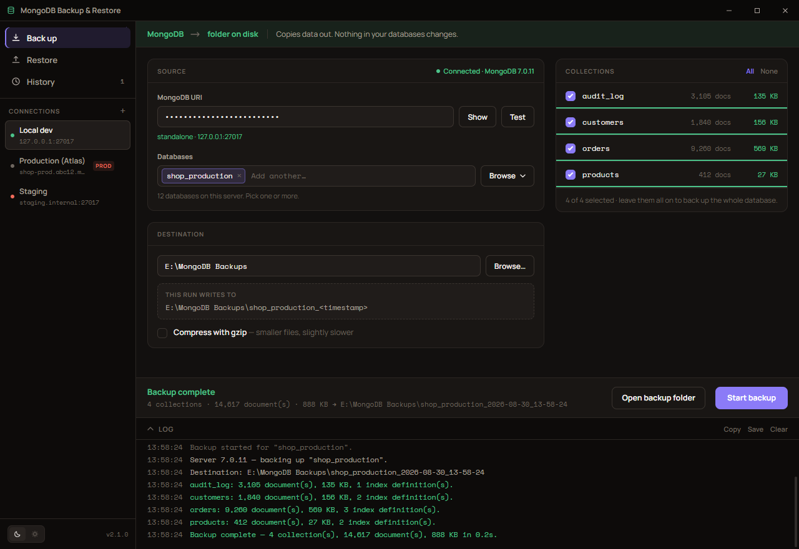
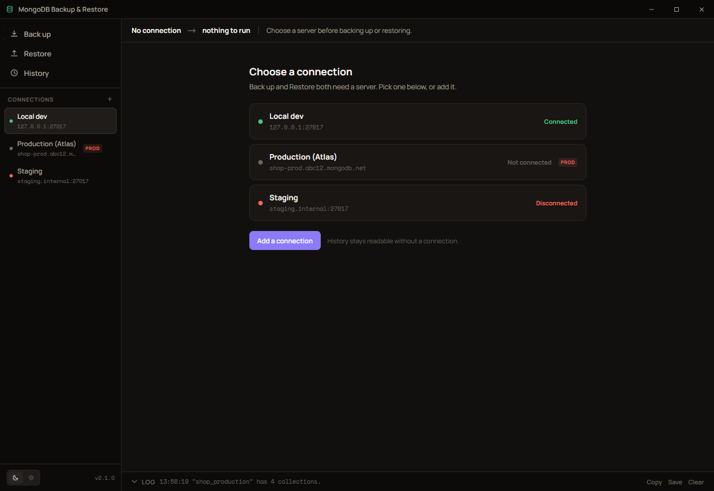
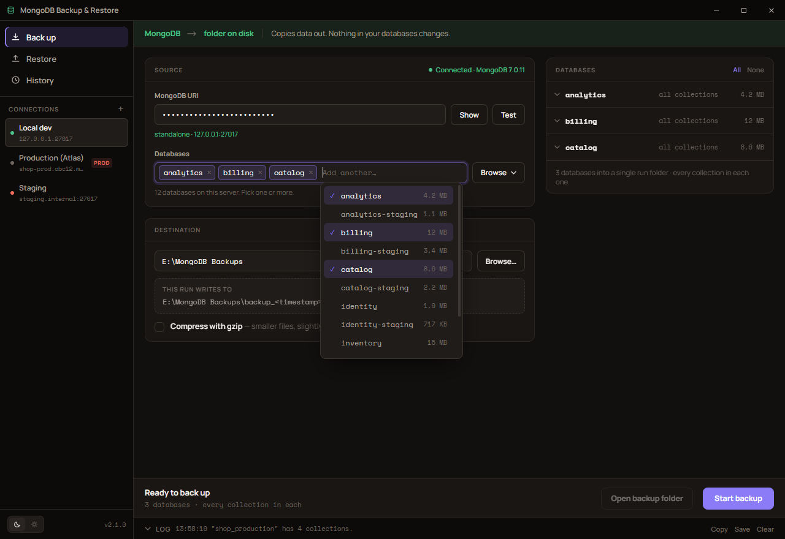
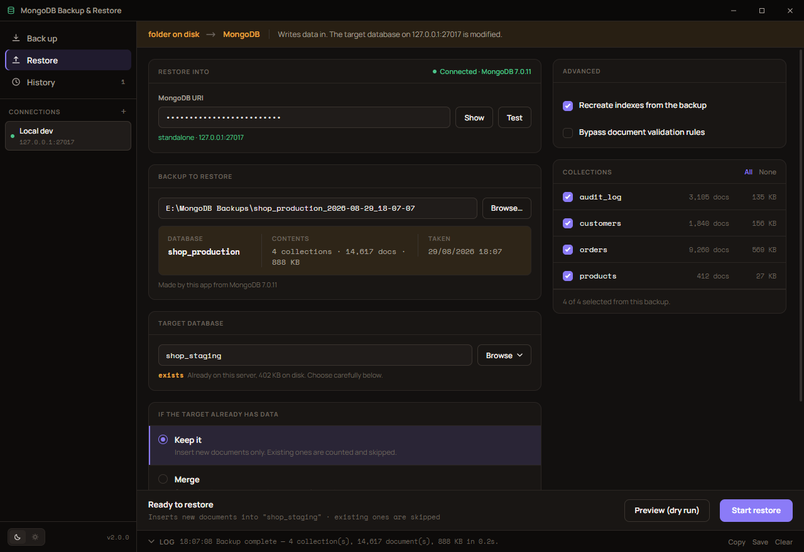
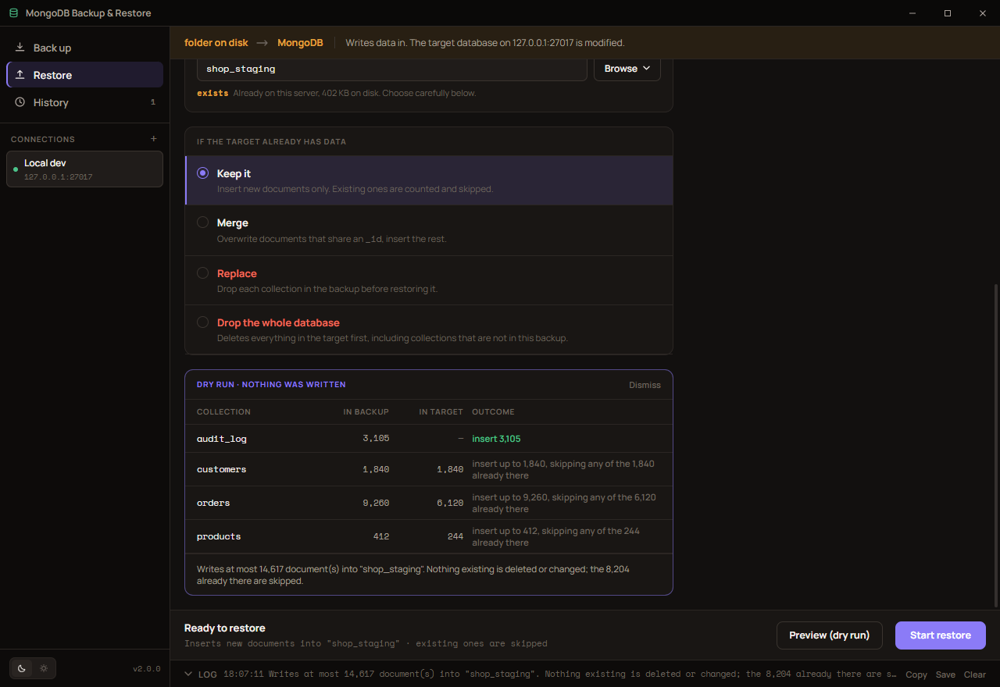
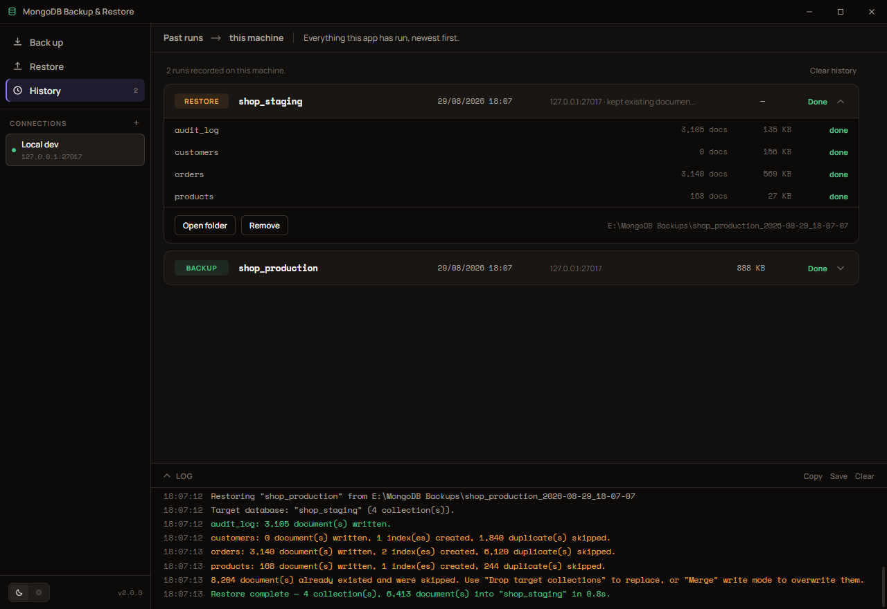
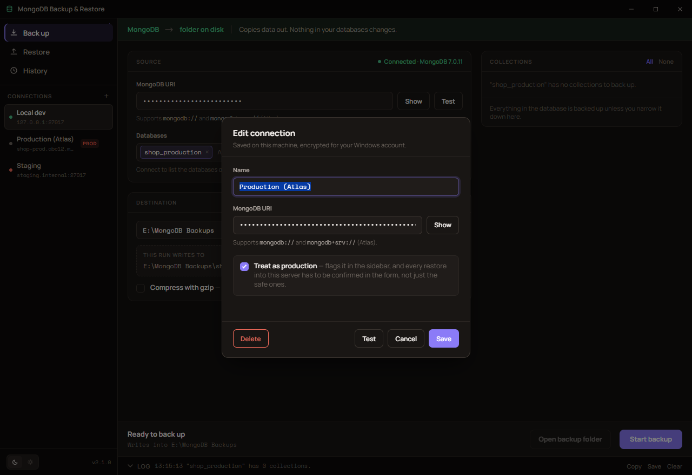
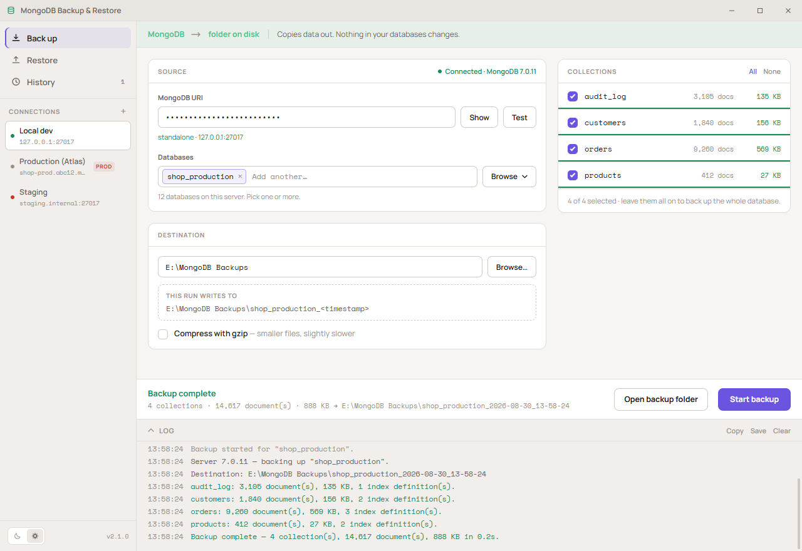

# MongoDB Backup and Restore

A Windows desktop app for backing up and restoring MongoDB databases. Paste a
connection string, name a database, click a button.

- **Back up** — one database, or several at once, → a folder on disk.
- **Restore** — a backup folder → target database, with a dry run first if you
  want to see what it would do.
- **History** — every run it has made, including the ones that failed.

No `mongodump.exe` or `mongorestore.exe` required. The app talks to MongoDB
directly through the official Node.js driver, but writes the **same directory
format mongodump uses**, so backups stay usable with the standard CLI tools and
dumps produced by those tools can be restored here.

Works with local servers, replica sets, sharded clusters, and MongoDB Atlas
(`mongodb://` and `mongodb+srv://`).



---

## Screenshots

**Choosing a connection.** The app opens here rather than on a form it cannot
run. Each connection reports whether it is reachable *now* — green live, red
gone, grey never used — because that dot is only worth having if it is true.



**Several databases at once.** The Databases field takes as many as you like.
With more than one selected the card becomes **Databases** — one collapsible row
each, opening onto that database's own collections, so every database in a run
can contribute a different set.



**Restoring.** The view carries its own colour and states the direction of
travel, because running a restore while believing you are running a backup is
the one mistake worth designing against. Four modes decide what happens to
existing data; the two that delete turn the button red, need a confirmation
ticked in the form, and confirm again against the target name.



**Dry run.** Before writing anything, the app reads the live target and reports
what each collection would actually get. The destructive modes are exact —
everything present is deleted, so the count is simply what is there now. The
safe modes are given as bounds, because how many of the backup's documents
already exist depends on their `_id`s, and the preview says so rather than
inventing precision it does not have.



**History.** Expand a run for its detail, open its folder, or load a backup
straight back into the restore form. A run over several databases opens onto a
row per database, each carrying its own collections — the same shape the form
had when the run was set up.



**Connections.** One dialog adds and edits them — name, URI, an optional
default database, and a **Test** that tries the URI without adopting it as the
app's connection. A connection can be marked **production**, which flags it red
in the sidebar and makes every restore into it ask for confirmation in the form.



**Light theme.** Starts from the Windows setting; the switch in the sidebar
overrides it and is remembered.



---

## Running it

```bash
npm install
```

```bash
npm start
```

### Building a Windows executable

```bash
npm run dist
```

Outputs to `release/`:

- `MongoDB Backup and Restore Setup <version>.exe` — installer (choose install
  location, adds a Start Menu shortcut).
- `MongoDB-Backup-Restore-<version>-portable.exe` — single file, no install.

Both are unsigned, so Windows SmartScreen will warn on first run
("More info" → "Run anyway"). Add a code-signing certificate to
`build.win.certificateFile` in `package.json` to remove that.

### The app icon

`build/icon.ico` is generated from `build/icon.svg` — the MongoDB leaf framed by
a backup/restore cycle. Edit the SVG and regenerate:

```bash
npm run icon
```

That rasterises 16/20/24/32/40/48/64/128/256px and packs them into the `.ico`.
Sizes up to 48px use `build/icon-small.svg` instead, which drops the cycle arcs
— at taskbar size they render as grey fuzz, so the leaf gets the space. Both
SVGs carry their geometry in a comment so the arcs stay editable.

Rasterising is done by Chromium and the `.ico` container is written directly, so
no image libraries are needed. The generator validates what it wrote and fails
loudly rather than shipping a malformed icon.

### Fonts

Manrope and Space Mono are bundled in `src/renderer/fonts/` rather than fetched
from Google Fonts: the renderer runs under a Content-Security-Policy that allows
`font-src 'self'` only, and a desktop tool has to render correctly offline. Both
are SIL OFL 1.1 — see [`fonts/NOTICE.md`](src/renderer/fonts/NOTICE.md).

---

## Telling the two directions apart

The costly mistake this app can make is running a restore while you believe you
are running a backup — the forms look alike, and in the safe restore mode the
damage is invisible until it isn't. So each direction carries its own identity:

| | Back up | Restore |
| --- | --- | --- |
| Accent | green | amber |
| Strip along the top | `MongoDB → folder on disk` | `folder on disk → MongoDB` |
| States | "Nothing in your databases changes" | "The target database on *host* is modified" |
| Primary button | accent | accent, turning **red** for Replace and Drop database |

The strip, the collection progress bars, and the rule above the action bar all
take that colour, so the direction is readable from the corner of your eye
rather than only from the heading.

**Both actions confirm before running.** The dialog names the direction
explicitly — a restore says *"This writes into the database. It does not create
a backup."* — which is the sentence that catches the mistake. It also names the
target database, the server host (credentials stripped), and what the chosen
mode will do to existing data. The two destructive modes additionally require a
checkbox ticked in the form, and that checkbox names the database it is about to
empty.

---

## One connection at a time

The app opens on the connection picker. Back up and Restore both need a server,
so neither is reachable until one is live; History does not, and stays readable.

The sidebar holds the saved connections, and the URI on the Back up and Restore
views is the same connection. Choosing a saved one connects and lists its
databases in a single handshake — which matters on Atlas, where each connect
carries an SRV lookup and a TLS negotiation.

### What the indicator means

A connection is opened once and then **held for the session**, so going back to
one you have already used is instant rather than a fresh handshake. That is what
makes the dot worth reading:

| | |
| --- | --- |
| **Green** | reachable right now |
| **Amber** | connecting |
| **Red** | was connected, and the server has gone |
| **Grey** | not used yet this session |

The colour comes from the driver's own topology monitoring rather than from what
the app last did, so it turns red when a server actually goes away — not when
the app merely stops talking to it — and back to green by itself when the server
returns. Losing the server puts the app back on the picker rather than leaving a
form that cannot run.

Backing up from one server and restoring into another therefore means switching
connection between the two, rather than keeping two URIs filled in at once. In
exchange, the server a restore is about to write to is never a stale value from
an earlier session: it is stated on the connection card, in the strip along the
top of the view, and in the confirmation dialog.

**+** adds a connection, and the pencil on a row edits it — both open the same
dialog: name, URI, and **Test**, which tries the URI without adopting it as the
app's connection. Editing also offers **Delete**.

### Marking a connection as production

The dialog has a **Treat as production** option. A connection marked that way is
flagged red in the sidebar, and *every* restore into it has to be confirmed in
the form — not only the modes that delete data. The safe modes are safe about
existing documents, not about which server they run against, and pointing at the
wrong one is the mistake this app exists to make hard.

### Where they are kept

Connection strings contain credentials, so they are encrypted at rest with
Windows DPAPI via Electron's `safeStorage` — readable only by your Windows user
account. If the OS keystore is unavailable the app refuses to save rather than
writing credentials in plain text.

Everything is stored in `%APPDATA%\MongoDB Backup and Restore\settings.json`.
Delete that file to reset the app.

---

## Backing up

1. Paste the **MongoDB URI**, or pick a saved connection from the sidebar.
   **Test** reports the server version and whether it is a standalone, replica
   set, or sharded cluster.
2. Choose the **databases**. Nothing is selected for you. **Browse** opens a
   picker you can type into to filter — servers with dozens of similarly named
   databases stay navigable — and clicking one adds it as a chip without closing
   the list, so several can go into one run. A name the server will not list can
   still be typed and used, which matters for accounts that can read a database
   but not enumerate them. The list carries **select all** and **clear**, scoped
   to whatever the filter is showing — type a term and take that whole group in
   one press. The field shows the first three and counts the rest, so selecting
   twenty does not bury the form; the count opens the list, where any of them
   can be unticked.
3. Choose where to save it. The card shows the exact folder this run will
   create, so a backup never overwrites an earlier one.
4. **Start backup.**

Selecting **one** database loads its collections into the **Collections** card,
all ticked; untick any you do not want.

Selecting **several** turns that card into **Databases**: a collapsible row per
database, each opening onto its own collections with its own tick boxes and its
own All/None. A database's collections are read only when you open it, so
selecting a dozen costs nothing until you want to narrow one — an unopened
database goes in whole. Leaving one with nothing ticked blocks the run and names
it. During a run those database rows are what fill with progress.

### Where a backup goes

| Selection | Layout |
| --- | --- |
| One database | `my_database_2026-08-18_18-30-00/` — unchanged from earlier versions |
| Several | `backup_2026-08-18_18-30-00/` with `shop/`, `billing/`, … inside |

Two runs started in the same second would collide on that name, so the second
gets a `-2` suffix rather than writing into the first one's folder.

The second is `mongodump`'s own root layout, so the whole set restores together,
any single database inside it restores on its own, and `mongorestore` reads it
too. Each subfolder carries its own manifest as well as one for the run.

### What a backup folder contains

```
my_database_2026-08-18_18-30-00/
├── users.bson                  ← documents, raw BSON
├── users.metadata.json         ← indexes + collection options
├── orders.bson
├── orders.metadata.json
└── backup-manifest.json        ← run summary (this app only)
```

Documents are copied as the exact BSON bytes the server sent — nothing is
decoded and re-encoded on the way out. Numeric types, `Decimal128`, `Binary`
subtypes, `Timestamp`, and field order all survive unchanged.

Also captured: indexes (including partial, unique, TTL, and text indexes),
capped-collection settings, collation, validators, and view definitions.

Restoring the same folder with the official CLI:

```bash
mongorestore --uri "mongodb://..." --db target_name --dir "path\to\my_database_2026-08-18_18-30-00"
```

---

## Restoring

1. Make sure the **connection** is the server you mean to write to. The account
   needs write access.
2. Choose the **backup folder**. The app reads it and reports the source
   database, how much is in it, and when it was taken.
3. Enter the **target database**. It defaults to the original name, but any name
   works — that is how you clone a database or restore into a staging copy. It
   is labelled *exists* or *will be created* as you type.
4. Pick what should happen **if the target already has data**.
5. **Preview (dry run)** to see what that would do, then **Start restore**.

### The four restore modes

| Mode | What it does |
| --- | --- |
| **Keep it** (default) | Inserts documents that are not there yet. Documents whose `_id` already exists are skipped and counted, never overwritten. Nothing is deleted. |
| **Merge** | Replaces documents that share an `_id`, inserts the rest. Use it to roll a database back to the backup's contents without dropping anything. |
| **Replace** | Drops each collection in the backup before restoring it. Collections *not* in the backup are left alone. |
| **Drop the whole database** | Drops the entire target database first, including collections not in the backup. |

The two destructive modes need the in-form confirmation ticked and then confirm
again in a dialog naming the exact database.

The **Advanced** card holds index creation and the document-validation bypass.

The restore also reads folders produced by `mongodump`, whether the folder
contains the `.bson` files directly or is a dump root with one subfolder per
database.

---

## History

Every run is recorded — completed, failed, or stopped — with how far it got.
Expand one for its detail, **Open folder** to see what it wrote, or **Restore
this** to load a backup straight into the restore form.

A single-database run opens onto its collections. A run over several is listed
as *“3 databases”*, with their names beside it, and opens onto a collapsible row
per database holding that database's own collections — so a run where one
database was narrowed and another taken whole reads back exactly that way.

Runs are kept in `%APPDATA%\MongoDB Backup and Restore\history.json`, capped at
the last 60. It records the **host** a run talked to but never the connection
string, so the file cannot be used to reach a server.

---

## About

Click the version in the sidebar for the About dialog: app version, the
Electron/Chromium/Node build it is running on, and **Copy details** to put all of
that on the clipboard for a bug report.

Built by Adrian Dela Cruz for **Versa Innovations Corp.**, originally as an
internal tool for Versa systems, and released here under the MIT licence.

---

## Tests

```bash
npm test
```

Five suites, all run against a real MongoDB (`mongodb://127.0.0.1:27017` by
default; pass a URI as an argument to point elsewhere):

| Script | What it proves |
| --- | --- |
| `npm run test:engines` | Seeds a database covering every awkward BSON type, backs it up, restores it, and compares the **raw BSON bytes** of every document plus index definitions — plain and gzipped. Also covers duplicate handling, merge mode, renamed targets, filename escaping for collection names that are illegal as Windows filenames, capped collections, views, input validation, and multi-database runs: the folder layout, a manifest per database, reading the set back as one dump root, restoring each database out of it, a different collection list per database, and the guard against two runs in the same second sharing a folder. |
| `npm run test:srv` | Covers the Atlas SRV/DNS fallback: seed-list URI composition, TXT-option precedence, the rule that a TXT record cannot downgrade TLS, rejection of SRV hosts outside the cluster domain, and DNS-error classification. Pass a cluster hostname (`npm run test:srv -- cluster0.xxx.mongodb.net`) to also run a live check that black-holes the system resolver and confirms the fallback still resolves the cluster. |
| `npm run test:compat` | Round-trips against the official tools: our backup → `mongorestore`, and `mongodump` → our restore. Skipped with a notice if the CLI tools are not on PATH. |
| `npm run test:ui` | Boots the real app under Electron and asserts the preload bridge, DOM wiring, and IPC round trips work, with no renderer console errors. Also covers the frameless window's own title bar and drag regions, that the bundled fonts really loaded under the CSP, that both themes repaint, that the picker stays height-capped and filterable with 45 databases, that the action bar stays pinned above the log dock while the form scrolls, that a destructive restore stays blocked until its confirmation is ticked, and that a saved connection string is never written to disk in plain text. Also that the app opens on the connection gate with Back up and Restore held back and History reachable, that no database is preselected, and that the picker takes several databases as chips while the restore target stays single-select. The connection dialog gets its own run through: **+** opens empty even with a connection selected and adds a second rather than renaming it, a duplicate name is refused, the row's pencil opens the dialog filled in and renames in place, and a production connection forces the confirmation even in the safe mode. |
| `npm run test:e2e` | Fills in the actual form fields and clicks the actual buttons, then verifies the data landed in MongoDB. Covers the gate opening on connect, the sidebar connecting on one click, a chosen database auto-loading its collections, per-collection progress reaching completion, a dry run reporting the target's real counts and writing nothing, a multi-database run producing one folder with a subfolder each — including expanding one database group, unticking a collection in it, checking only that collection list reached disk, and that History then lists the run as two databases and shows only the collections that were actually taken — and both runs landing in History with the host but no connection string — checked against the file on disk. It also proves the indicator is honest: it connects through a TCP proxy, cuts it, and asserts the dot turns red and the app returns to the gate. |

The UI suites run against a throwaway Electron profile, so they never touch your
saved connections, preferences, or history.

---

## Releases and versioning

Versions follow [semver](https://semver.org), read from the user's point of view:
**major** for a backup format older versions cannot read or a workflow removed,
**minor** for new capability, **patch** for fixes that change nothing you relied
on. Every release is written up in [CHANGELOG.md](CHANGELOG.md).

Write the changelog entry for the new version first, so the tag ends up
containing its own release notes. Then bump, which commits and tags:

```bash
npm version patch
```

Then cut the release:

```bash
npm run release
```
